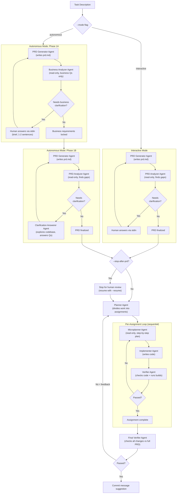
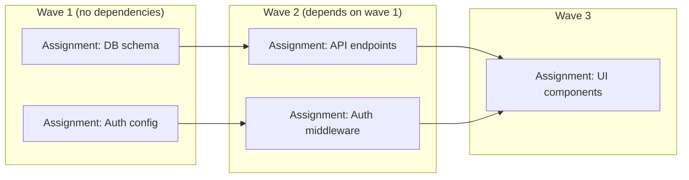

# Claude Code Agent Pipeline Orchestrator

I made this for my own needs. I pushed it here to make it transparent how I made certain projects. It has a lot of flaws I would love to address soon and I hope I am going to get resources to do so when I get less busy.

A TypeScript orchestration layer that coordinates specialized [Claude Code](https://docs.anthropic.com/en/docs/claude-code) subagents through a structured pipeline: PRD generation, clarification, planning, implementation, and verification.

Designed as a standalone repo that can be added to any project workspace via multi-root VS Code workspaces. The orchestrator lives in its own directory; you point it at a target project via `--project-dir` and agents operate on that project using absolute paths.

## Prerequisites

- [Claude Code CLI](https://docs.anthropic.com/en/docs/claude-code) installed and authenticated (`claude --version`)
- Node.js 18+ (for `tsx` runtime)

## Quick Start

```bash
# From the orchestrator repo root, pointing at your project:
npx tsx src/orchestrate.ts --mode autonomous --stop-after-prd --project-dir /path/to/your/project

# Or omit --project-dir to be prompted interactively:
npx tsx src/orchestrate.ts --mode autonomous --stop-after-prd
```

Or use VS Code tasks (Ctrl+Shift+P > "Tasks: Run Task") — each task prompts for the project directory:

| Task | What it does |
|------|-------------|
| Pipeline: Autonomous + Stop After PRD | Best default -- asks brief business questions, AI handles technical ones, stops for PRD review |
| Pipeline: Interactive | Human answers all clarification questions |
| Pipeline: Resume | Continue from last saved state (project dir restored automatically) |
| Pipeline: Dry Run | Test the flow without invoking Claude (no cost) |

## How It Works

### Pipeline Overview



### Modes

**Interactive** -- The default. After generating a PRD, the analyzer identifies gaps. The script prompts you in the terminal for answers. Good for hands-on control.

**Autonomous** -- Two-phase approach:
1. **Business clarification** (human) -- A specialized analyzer asks only high-level business questions (scope, priorities, user behavior). Brief, 1-2 sentence answers.
2. **Technical clarification** (AI) -- A clarification-answerer agent explores the codebase and answers technical questions autonomously. Runs unattended.

The autonomous mode is opinionated toward minimal implementation -- the clarification answerer is instructed to follow YAGNI principles and steer away from over-engineering.

### Agents

| Agent | Role | Model | Tools | Budget |
|-------|------|-------|-------|--------|
| `prd-generator` | Writes the PRD document | opus | Read, Write, Grep, Glob, Bash, WebFetch | $2.00 |
| `prd-analyzer` | Reviews PRD for gaps, asks clarification questions | opus 4.5 | Read, Grep, Glob | $1.00 |
| `business-analyzer` | Reviews PRD for business-only gaps (autonomous mode) | opus | Read, Grep, Glob | $0.50 |
| `clarification-answerer` | Answers technical questions using codebase context | opus 4.5 | Read, Grep, Glob, Bash, WebFetch | $1.50 |
| `planner` | Divides work into sequential assignments | opus 4.5 | Read, Grep, Glob | $2.00 |
| `microplanner` | Creates step-by-step coding plan per assignment | opus 4.5 | Read, Grep, Glob | $0.50 |
| `implementer` | Writes the actual code | opus 4.5 | Read, Edit, Write, Bash, Grep, Glob, WebFetch | $3.00 |
| `verifier` | Checks implementation against assignment requirements | opus 4.5 | Read, Grep, Glob, Bash | $1.00 |
| `final-verifier` | Checks all changes against full PRD, runs builds | opus 4.5 | Read, Grep, Glob, Bash | $2.00 |

Budget values are per-invocation caps via `--max-budget-usd`. Agent definitions live in `.claude/agents/*.md`.

### Clarification Answerer Session Lifecycle

To balance cost and quality, the clarification answerer reuses Claude sessions:

```
Round produces 8 questions:

  Instance 1 (session abc-123):
    Q1: claude -p  (fresh -- loads PRD, task, explores codebase)
    Q2: claude --resume abc-123  (reuses context)
    Q3: claude --resume abc-123
    Q4: claude --resume abc-123
    Q5: claude --resume abc-123  --> 5 questions reached, discard session

  Instance 2 (session def-456):
    Q6: claude -p  (fresh context load)
    Q7: claude --resume def-456
    Q8: claude --resume def-456  --> round complete
```

Configurable via `limits.maxQuestionsPerAnswererInstance` in `config.json`.

## Project Structure

```
.claude/
  agents/                         Agent persona definitions (*.md) -- Claude CLI requires this path
    prd-generator.md
    prd-analyzer.md
    business-analyzer.md
    clarification-answerer.md
    planner.md
    microplanner.md
    implementer.md
    verifier.md
    final-verifier.md
src/
  orchestrate.ts                  Main entry point -- mode registry, pipeline flow
  lib/
    runner.ts                     Spawns claude CLI, parses JSON responses, retries
    types.ts                      All TypeScript interfaces
    utils.ts                      State I/O, CLI parsing, user prompts, logging
config.json                       Agent models, budgets, turn limits, pipeline limits
state/                            Runtime state (gitignored, created on first run)
  pipeline-state.json
  task.md
  prd.md
  clarifications.json
  business-clarifications.json
  plan.json
  assignments/
    <assignment-id>/
      microplan.json
      changes.json
      verification.json
.vscode/
  tasks.json                      VS Code task shortcuts for all pipeline modes
package.json
tsconfig.json
```

## Configuration

All configuration lives in `config.json` at the repo root:

```json
{
    "agents": {
        "prd-generator": { "model": "claude-opus-4-6", "maxTurns": 30, "maxBudgetUsd": 2.00 },
        "implementer":   { "model": "claude-opus-4-5-20251101", "maxTurns": 50, "maxBudgetUsd": 3.00 }
    },
    "limits": {
        "maxBusinessClarificationRounds": 3,
        "maxClarificationRounds": 5,
        "maxQuestionsPerAnswererInstance": 5,
        "maxImplementationIterations": 3,
        "maxPipelineRetries": 2,
        "agentTimeoutMinutes": 30
    },
    "defaultMode": "interactive",
    "buildCommands": ["npm run build"],
    "projectContext": ""
}
```

| Setting | Description |
|---------|-------------|
| `agents.<name>.model` | Claude model to use for this agent |
| `agents.<name>.maxTurns` | Max autonomous tool-call actions per session |
| `agents.<name>.maxBudgetUsd` | Per-invocation cost cap |
| `limits.agentTimeoutMinutes` | Process timeout for each agent invocation (default: 30) |
| `limits.maxClarificationRounds` | Max PRD clarification rounds before proceeding |
| `limits.maxBusinessClarificationRounds` | Max business-only clarification rounds (autonomous mode) |
| `limits.maxImplementationIterations` | Max microplan/implement/verify retries per assignment |
| `limits.maxPipelineRetries` | Max full pipeline retries if final verification fails |
| `buildCommands` | Shell commands the verifier runs to check builds |
| `projectContext` | Extra context appended to the PRD generator prompt |

## CLI Reference

```bash
npx tsx src/orchestrate.ts [options] [task]
```

| Flag | Description |
|------|-------------|
| `--project-dir <path>` | **Absolute path to the target project directory.** If omitted, prompts interactively. Saved in state for `--resume`. |
| `--mode <name>` | Pipeline mode: `interactive` (default) or `autonomous` |
| `--stop-after-prd` | Stop after PRD finalization for human review |
| `--resume` | Resume from last saved pipeline state (project dir + mode restored from state) |
| `--dry-run` | Run the full flow with mock agent responses (no cost) |
| `--task-file <path>` | Read task description from a file |
| `"task description"` | Inline task description |

If no task is provided, the script prompts interactively. If no `--project-dir` is provided, the script prompts for it before starting.

## Adding to a Workspace

Add this repo to your VS Code multi-root workspace alongside your project:

```
your-workspace.code-workspace
├── claude-orchestration/    ← this repo (orchestrator scripts, config, agents, state)
└── your-project/            ← the target project agents will modify
```

The orchestrator resolves its own files (config, agents, state) from its install location automatically — regardless of where you invoke it. Agents are spawned with `cwd` set to the orchestrator root so they find `.claude/agents/` and `state/` files. Each agent prompt is injected with the `--project-dir` path so all project file operations use absolute paths.

On `--resume`, the project directory is restored from saved pipeline state — no need to pass it again.

Update `buildCommands` and `projectContext` in `config.json` for your project.

The `state/` directory is created at runtime and is gitignored.

## How the Runner Works

The orchestrator spawns each Claude CLI invocation as an async child process (`child_process.spawn`), not `execFileSync`. This provides:

- **Real-time stderr streaming** -- any Claude CLI output appears immediately in the terminal
- **Heartbeat logging** -- a "still running..." message every 60 seconds so you know it's alive
- **Configurable timeout** -- `agentTimeoutMinutes` in config (default 30 min)
- **Graceful kill** -- SIGTERM on timeout, SIGKILL after 5s if needed
- **Retry with backoff** -- up to 4 retries per agent invocation
- **Pre-flight check** -- verifies `claude` CLI is available before starting

Important: stdin is opened as a pipe (not `/dev/null`) because the Claude CLI hangs when stdin is closed immediately.

## Design Decisions

- **Separate orchestrator and project repos** -- the orchestrator resolves its own root via `import.meta.url` (not `process.cwd()`), so it works regardless of invocation directory. Agents are told the project path via prompt injection and use absolute paths for all project file operations. State stays in the orchestrator repo.
- **`--project-dir` prompt** -- if not provided on the CLI, the orchestrator prompts interactively. The value is saved in `pipeline-state.json` so `--resume` restores it automatically.
- **Agents in `.claude/agents/`** -- required by the Claude CLI convention. Everything else (`src/`, `config.json`, `state/`) lives at the repo root.
- **Modes only control the PRD phase** -- the pluggable boundary is the PRD clarification strategy. Planning, implementation, and verification are shared. This keeps modes simple.
- **Autonomous mode steers toward minimal scope** -- the clarification answerer follows YAGNI. No gold-plating, no premature abstractions.
- **`--json-schema` for structured output** -- every agent returns validated structured data, not free-form text.
- **`--tools` enforces read-only** on analyzers and planners (they literally cannot write files).
- **Resume-aware** -- all loops check existing state files and continue from where they left off.
- **Sequential assignments** -- assignments execute one at a time in dependency order. Parallel execution is a future enhancement.

## Future Scaling

### Parallel Assignment Execution

Assignments currently execute sequentially. The planner already produces a `dependsOn` field per assignment, which forms a dependency DAG. This enables parallel execution of independent assignments:



Implementation path:
- Group assignments into waves by topological sort on `dependsOn`
- Within each wave, spawn multiple `claude -p` processes concurrently (each assignment gets its own Microplanner / Implementer / Verifier cycle)
- Wait for the entire wave to complete before starting the next
- Each parallel agent operates on non-overlapping files (`estimatedFiles` in the plan), reducing merge conflicts
- A post-wave merge step could run the Verifier across all wave outputs to catch cross-assignment issues

### Config-Driven Custom Modes

The mode registry currently requires TypeScript code to register a new mode. A future enhancement would allow defining modes purely through configuration:

```json
{
    "modes": {
        "interactive": {
            "description": "Human answers all clarification questions",
            "prdPhase": {
                "clarificationStrategy": "human",
                "analyzerAgent": "prd-analyzer",
                "maxRounds": 5
            }
        },
        "autonomous": {
            "description": "Business Qs for human, technical Qs answered by AI",
            "prdPhase": {
                "stages": [
                    {
                        "name": "business",
                        "clarificationStrategy": "human",
                        "analyzerAgent": "business-analyzer",
                        "maxRounds": 3
                    },
                    {
                        "name": "technical",
                        "clarificationStrategy": "agent",
                        "analyzerAgent": "prd-analyzer",
                        "answererAgent": "clarification-answerer",
                        "maxRounds": 5
                    }
                ]
            }
        },
        "fully-autonomous": {
            "description": "AI answers all questions, zero human input",
            "prdPhase": {
                "clarificationStrategy": "agent",
                "analyzerAgent": "prd-analyzer",
                "answererAgent": "clarification-answerer",
                "maxRounds": 5
            }
        }
    }
}
```

This would allow creating new modes (e.g. `fully-autonomous`, `review-only`, `analysis`) without touching TypeScript -- only `config.json` and optionally a new agent `.md` file. The orchestrator would interpret the config and compose the clarification loop dynamically.

Other possible config-driven modes:

| Mode | Description | How it differs |
|------|-------------|----------------|
| `fully-autonomous` | Zero human input, AI answers everything | Single-stage, agent clarification only |
| `review-only` | Analyze codebase against a PRD, no implementation | Runs PRD + analysis phases, skips planning/implementation |
| `refactor` | Agent identifies and executes refactoring | Custom analyzer focused on code smells, skips PRD |
| `pr-review` | Reviews a git diff against requirements | Reads diff instead of task, outputs review report |

## Known Issues

1. **`--dry-run` writes mock state** -- can set `phase: "complete"` which breaks subsequent `--resume`. Reset `pipeline-state.json` before resuming after a dry run.
2. **Stale clarification references** -- when the PRD is regenerated, old clarification questions reference requirement IDs that no longer exist. The PRD generator prompt warns about this.
3. **Agent-answered clarifications may be lower quality** -- the `source: 'agent'` tag on clarification entries allows the PRD generator to weigh them differently.

## Reference Links

- [Claude Code CLI Reference](https://docs.anthropic.com/en/docs/claude-code/cli-reference)
- [Claude Code Subagents](https://docs.anthropic.com/en/docs/claude-code/sub-agents)
- [Headless / Print Mode](https://docs.anthropic.com/en/docs/claude-code/headless)
- [Structured Outputs (`--json-schema`)](https://platform.claude.com/docs/en/agent-sdk/structured-outputs)
